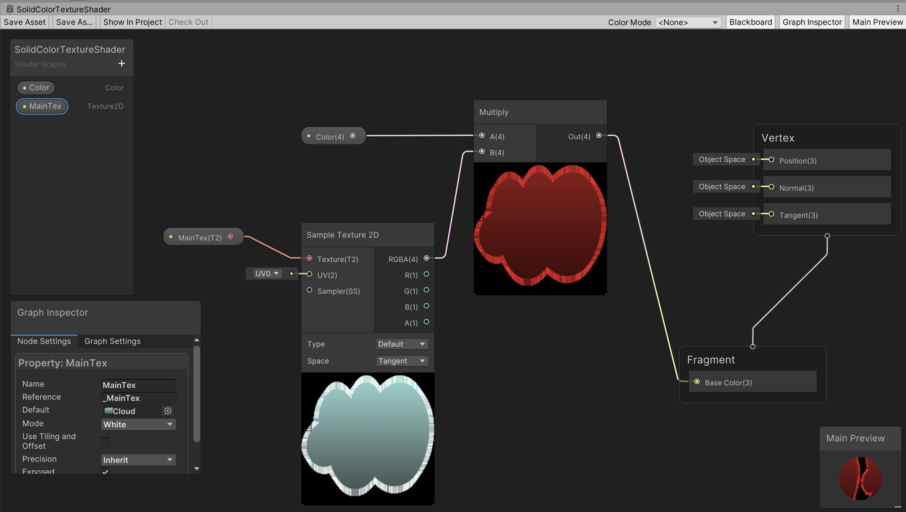
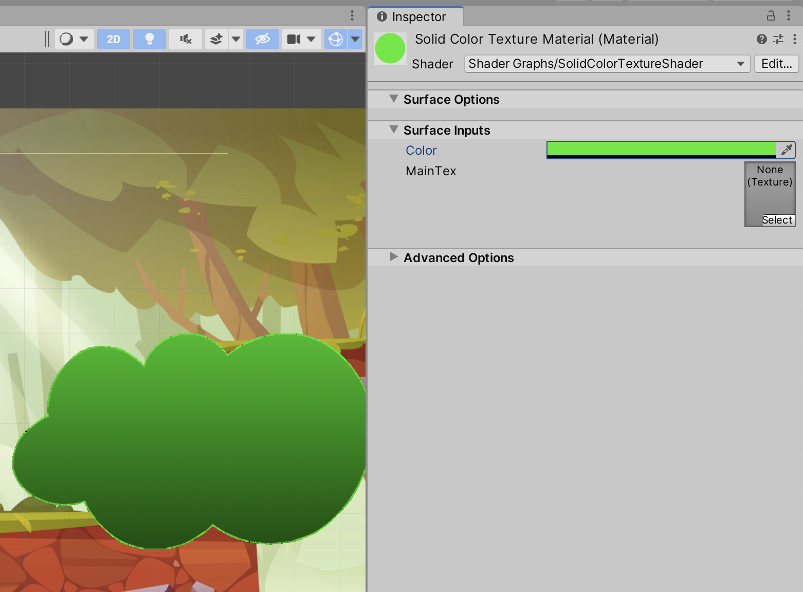
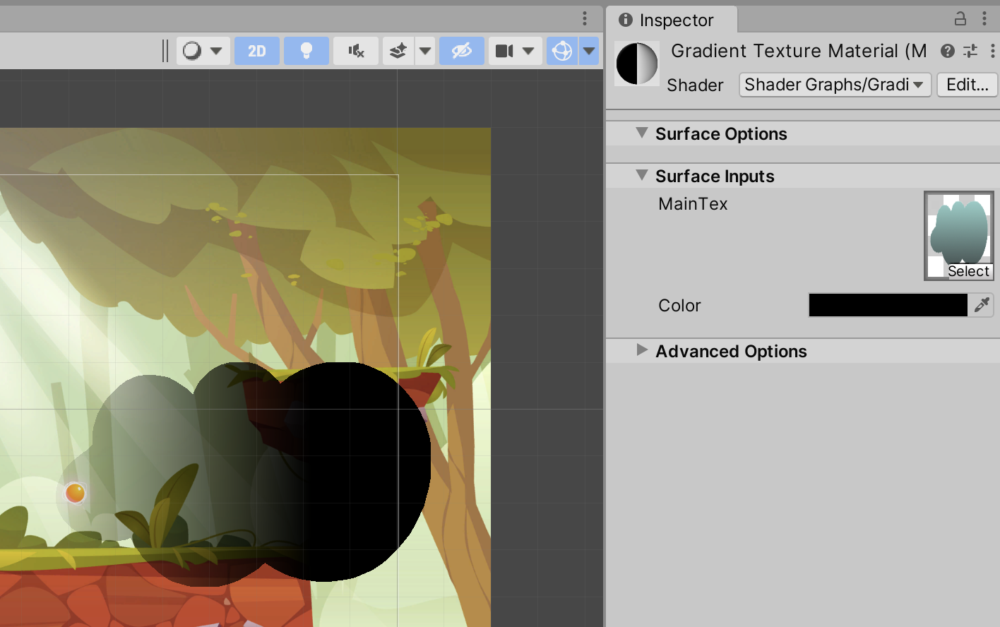

# unity-shader-graph-2d

Example of using shader graphs. See https://github.com/rasmusselsmark/unity-hlsl-shaders-2d for similar examples using HLSL programming.

# Shader examples

## Get started

1. Open `Window -> Package Manager`
1. Install `Shader Graph` package
1. Create folder `Shaders`

## SolidColorTextureShader

Shader to set color for a texture

1. Select the `Shaders` folder
1. Create `Shader Graph -> Builtin -> Unlit Shader Graph` and name it `SolidColorTextureShader`
1. Final shader graph:
   
1. Remember to click `Save Asset` button in upper-left corner to save the shader graph
1. Right-click shader in Project window and select `Create -> Material` and name it `SolidColorTextureMaterial`
1. In Scene window, select the cloud and select `SolidColorTextureMaterial` as material
1. You can now e.g. choose a green color for the cloud:
   

## GradientTextureShader

Make texture less transparent over x-axis

1. Select the `Shaders` folder
1. Create `Shader Graph -> Builtin -> Unlit Shader Graph` and name it `GradientTextureShader`
1. In `Graph Settings`, set `Surface Type` to `Transparent`
1. Final shader graph:
   
1. Remember to click `Save Asset` button in upper-left corner to save the shader graph
1. Right-click shader in Project window and select `Create -> Material` and name it `GradientTextureMaterial`
1. In Scene window, select the cloud and select `GradientTextureMaterial` as material
1. Example:
   

# Links and credits

## Recommended videos:
* [Make Awesome Effects with Shader Graph in Unity!](https://www.youtube.com/watch?v=VsUK9K6UbY4)

## Credits:
* [Background image by upklyak](https://www.freepik.com/free-vector/game-platform-cartoon-forest-landscape-2d-ui-design-computer-mobile-bright-wood-with-green-trees-grass-lianas-background-with-arcade-elements-jumping-bonus-items-nature-locations_12345468.htm#query=platform%20game%20background&position=17&from_view=keyword)
