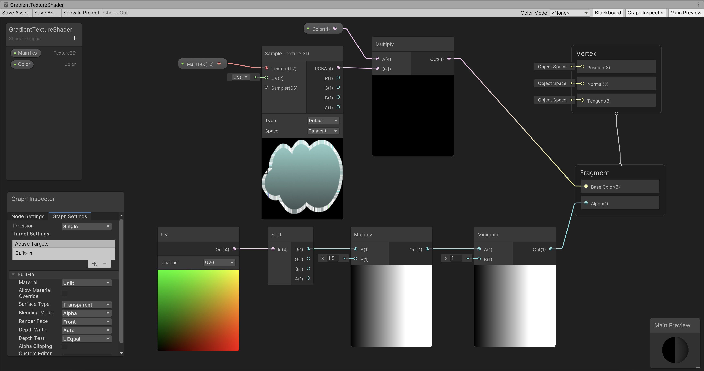

# unity-shader-graph-2d

Example of using shader graphs. See https://github.com/rasmusselsmark/unity-hlsl-shaders-2d for similar examples using HLSL programming.

# Getting started

1. Create a new 2D project in Unity (both URP or built-in works)
1. Download and import [Graphics.unitypackage](https://github.com/rasmusselsmark/unity-shader-graph-2d/raw/main/Graphics.unitypackage) into your project
1. Drag both background and cloud into to your scene
   - Set position of background image to (0, 0, 0) and scaling (0.4, 0.4, 1)
   - Set position of cloud image to (0, 0, -1) to bring it in front of background. Just keep scale at 1
1. It should look something like this:
   
1. Open `Window -> Package Manager`
1. Install `Shader Graph` package
1. Create folder `Shaders`

# Shader examples

## SolidColorTextureShader

Shader to set color for a texture

1. Select the `Shaders` folder
1. Create `Shader Graph -> Builtin -> Unlit Shader Graph` and name it `SolidColorTextureShader`
1. Add two variables `Color` and `MainTex` by clicking the `+` icon:  
   
1. Drag the two variables into the graph view
1. Right-click and select `Create Node -> Input -> Texture -> Sample Texture 2D`
1. Connect the `MainTex` variable to `Texture (T2)` in the added node. Also to see how the shader will work, choose a default texture for the variable:  
   
1. Add a new node `Math -> Basic -> Multiply` and connect `Color` and output from `Sample Texture 2D`
1. Final shader graph should look like this:
   
1. Remember to click `Save Asset` button in upper-left corner to save the shader graph
1. Right-click shader in Project window and select `Create -> Material` and name it `SolidColorTextureMaterial`
1. In Scene window, select the cloud and select `SolidColorTextureMaterial` as material
1. You can now e.g. choose a green color for the cloud:
   

## GradientTextureShader

Make texture less transparent over x-axis

1. Select the `Shaders` folder
1. Create `Shader Graph -> Builtin -> Unlit Shader Graph` and name it `GradientTextureShader`
1. In `Graph Settings`, set `Surface Type` to `Transparent`
1. Final shader graph:
   
1. Remember to click `Save Asset` button in upper-left corner to save the shader graph
1. Right-click shader in Project window and select `Create -> Material` and name it `GradientTextureMaterial`
1. In Scene window, select the cloud and select `GradientTextureMaterial` as material
1. Example:  
   

## PulsatingShader

For fun, let's make a pulsating shader, i.e. that makes our sprite appears/disappears in a regular rythm. We can use the [Sine function](https://www.mathsisfun.com/sine-cosine-tangent.html) to get this behavior. 

Use https://www.desmos.com/calculator for experimenting with Sine function (hint: we use `sin(x) * 0.5 + 0.5` to get value in range [0..1])

1. The final shader graph:  
   

# Links and credits

## Recommended videos:
* [Make Awesome Effects with Shader Graph in Unity!](https://www.youtube.com/watch?v=VsUK9K6UbY4)

## Credits:
* [Background image by upklyak](https://www.freepik.com/free-vector/game-platform-cartoon-forest-landscape-2d-ui-design-computer-mobile-bright-wood-with-green-trees-grass-lianas-background-with-arcade-elements-jumping-bonus-items-nature-locations_12345468.htm#query=platform%20game%20background&position=17&from_view=keyword)
